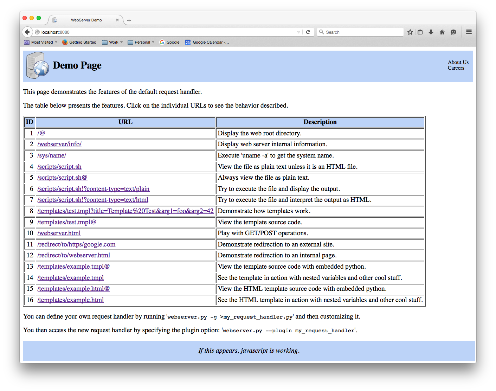

# webserver
Simple python webserver than demonstrates GET/POST handling for HTTP/HTTPS

## Introduction

Simple web server that demonstrates how browser/server interactions
work for HEAD, GET and POST requests using HTTP or HTTPS. It can be
customized using plugins.

This is an all-in-one solution. You do not need to separate out your
server from your code and you do not need a web server gateway
interface (WSGI). Just run this single program with a custom plugin
or use the default plugin.

It is not replacement for production systems. It is more of a
demonstration project that shows how all of the pieces fit together.

You can use it as a starting point to create a custom web server for
handling specific requests or for improving your understanding of how
web servers work but don't try to use it for any production work
unless it is for a simple, low traffic site.

It is very easy to use, simply run it and it will start serving
content from the current directory. To get a feeling for the
features available point it to the www directory that is included
in the repository.

```bash
$ ./webserver.py --webdir www
```

This will start up an HTTP server listening on port 8080 for the local
host using the current directory as the root of the web directory
handling requests with the built in default request handler.

You can then view the output using favorite browser:

```bash
$ firefox localhost:8080
```

This is what it will look like:

   

See the specific examples in the help below for more usage details.

One interesting feature of the default plug-in is that it allows you
to embed python directoy in your HTML. For a custom system you may
want to get rid of the other features and just keep this one.

## Python Embedded in HTML

You can embed python code directly in your HTML and the default
plug-in will process it. This allows dynamic web pages to be created.

Here is a very simple example of how it works.

```html
<!DOCTYPE HTML>
<!-- python
  params = locals()
  params['title'] = 'Title of Page'
  params['arg1'] = 'foo'
  params['arg2'] = 42
-->
<html>
  <head>
    <meta charset="utf-8">
    <title>{title}</title>
  </head>
  <body>
    <pre>
     arg1 = {arg1}
     arg2 = {arg2}
    </pre>
  </body>
</html>
```

As you can see, the python code defines the values of variables that
used in the HTML.

The format of the variables is the same that used for string.format()
operations (string.Formatter objects) so they are very flexible.

The embedded python can also reference other files. Here is an
example of how that works:

```html
<!DOCTYPE html>
<!-- python
  # Define the variables used on the page using
  # the full power of python.
  # The params dictionary is defined by the
  # request handler.
  import datetime
  import os
  import sys
      
  def read_file(params, ifn):
    '''
    Read a file.
    '''
    try:
      ifn = os.path.join(params['sysdir'], ifn)
      with open(ifn, 'r') as ifp:
        return ifp.read()
    except IOError as exc:
      return 'Read failed for {0}: {1!r}.'.format(ifn, exc)
    
  params = locals()
      
  params['page_header'] = read_file(params, 'page_header.html')
  params['page_footer'] = read_file(params, 'page_footer.html')
  params['title'] = 'Template Test of Embedded Python'
      
  # This is referenced by the page_header after the substitution.
  params['date'] = datetime.datetime.now().strftime('%Y-%m-%d %H:%M:%S')
      
  params['python_version'] = 'Python {0}.{1}.{2}'.format(sys.version_info[0],
                                                             sys.version_info[1],
                                                             sys.version_info[2])
  data = ''
  for i in range(5):
     data += '   {0} Count {0}\n'.format(i)
  params['data'] = data[:-1]  # strip the last new line
    
  params['top'] = '<a href="/">Top</a>'
  -->
<html>
  <head>
    <meta charset="utf-8">
    <title>Template Test</title>
    <link rel="icon" type="image/png" href="/webserver.png">
    <link href="/webserver.css" rel="stylesheet">
    <script src="/webserver.js"></script>
  </head>
  <body>
    <!-- page header (references {title} and {date}) -->
    {page_header}
        
    <!-- page body -->
    <pre>
{python_version}
    
Loop Data
{data}
    </pre>
{top}    
    <!-- page footer -->
    {page_footer}
  </body>
</html>
```

The python code will be left justified automatically but other than
that it must have proper indenting.

The following variables are available to embedded python code.

Variable              | Description
--------------------- | -----------
`params['sysdir']`    | The system directory path (ex. `opt/webdir/www/templates`). <br>Used to construct file names for reading nested files.
`params['sysfile']`   | The system file path (ex. `/opt/webdir/www/templates/example.html`).
`params['urldir']`    | The URL directory path (ex. `/templates`).
`params['urlfile']`   | The URL file path (ex. `/templates/example.html`).
`params['urlprefix']` | the protocol, domain and port in URL format (ex. `http://localhost:8080`)

## Example 1. Getting Help

There is a lot of help available from the program itself.

```bash
$ ./webserver.py --help
```

## Example 2: HTTP server for current directory.

This shows the basic usage. It will create a server that
allows you to browse the current directory.

```bash
$ ./webserver.py

$ # client - in another window
$ firefox http://localhost:8080
```

## Example 3: HTTPS server for current directory on port 8443.

This shows how to run server as an HTTPS server using a self-signed
certificate.

```bash
$ # Create the self signed certificate.
$ openssl req \
     -subj '/CN=localhost/O=My Organization LTD/C=US/ST=Washington/L=Seattle' \
     -new -newkey rsa:2048 -days 365 -nodes -x509 -sha256 \
     -keyout server.key -out server.crt
$ cat server.crt server.key >server.pem
$ ./webserver.py --https --cert ./server.pem --port 8443

$ # client - in another window
$ firefox http://localhost:8443
```

## Example 4: HTTP server for a project directory.

This shows how to run the server for a specific project
directory.

```bash
$ ./webserver.py --webdir /opt/projects/mysite/www

$ # client - in another window
$ firefox http://localhost:8080
```

## Example 5: Daemon HTTP server for a project directory.

This shows how to run the server as daemon. For a production
system you would probably want to use something likesystemd or
supervisord to daemonize the process.

```bash
$ ./webserver.py \
      --webdir /opt/projects/mysite/www \
      --daemonize \
      --log-file /opt/projects/mysite/log/webserver.log \
      --pid-file /opt/projects/mysite/log/webserver.pid

$ # client - in another window
$ firefox http://localhost:8080
```

## Example 6: HTTP server for a project directory with custom plugin.

This example shows how to create a plugin using the -g (--generate)
option and use it. You can customize it to add all sorts of behavior.

```bash
$ mkdir -p /opt/projects/mysite/src
$ ./webserver.py -g >/opt/projects/mysite/src/plugin.py  # create the plug in
$ edit /opt/projects/mysite/src/plugin.py  # customize it
$ ./webserver.py \
      --webdir /opt/projects/mysite/www \
      --plugin /opt/projects/mysite/src/plugin.py \
      --extra 'plugin_param1=foobar'

$ # client - in another window
$ firefox http://localhost:8080
```

## Example 7: Full blown example for daemonized HTTPS server.

This is what a full blown example of a daemonized HTTPS server
might look.

```bash
$ ./webserver.py \
      --webdir /opt/projects/mysite/www \
      --plugin /opt/projects/mysite/src/plugin.py \
      --https \
      --cert /opt/projects/mysite/www/server.pem \
      --port 8443 \
      --daemonize \
      --log-file /opt/projects/mysite/log/webserver.log \
      --pid-file /opt/projects/mysite/log/webserver.pid
```

## Example 8. Full blown example of an HTTPS server for a service like systemd.

This example shows how you might run the webserver under a process
management tool like systemd or supervisord.

```bash
$ ./webserver.py \
      --webdir /opt/projects/mysite/www \
      --plugin /opt/projects/mysite/src/plugin.py \
      --https \
      --cert /opt/projects/mysite/www/server.pem \
      --port 8443
```

## Example 9. Show how templates work.

This example shows how templates work by filling three variables on the command line.

```bash
$ ./webserver.py --webdir www -L debug

$ # client - in another window
$ firefox "http://localhost:8080/templates/test.tmpl?title=Templates&arg1=foo&arg2=42"
```

You can also define the variable values directly in the template or HTML code by embedding python.
Here is how you would define the variables for the example above.

```html
<!DOCTYPE HTML>
<!-- python
  params = locals()
  params['title'] = 'Page Title'
  params['arg1'] = 'foo'
  params['arg2'] = 42
-->
.
.
```

Embedded python code can do much more than simply substitution because 
it can use the full power of python. See www/template/example.html for
an example.

## Example 10. Redirection.

This example shows how redirection works in the default plugin. It
recognizes the `http://localhost:8080/redirect/to/` and then redirects
to the specified internal or external URL. An external url is defined
by a '/http/' or '/https/' prefix.

```bash
$ ./webserver.py --webdir www -L debug

$ # client - in another window --> external, https://google.com
$ firefox "http://localhost:8080/redirect/to/https/google.com"

$ # client - in another window --> internal, /webserver.html
$ firefox "http://localhost:8080/redirect/to/webserver.html"
```


## Plugins

Plugins are python modules that implement a callback function from the
server request handler. They provide you with complete control over how
the request data is processed. You can execute programs, access databases,
recognize dummy URLs, deal GET/POST data, fill in templates among other
things.

The default callback function name is request_handler(req) but you can
use another name if you wish. It accepts a single argument: the
request object which is derived from the
SimpleHTTPServer.SimpleHTTPRequestHandler). It has three additional
functions that let you access the server logger and the server
options where req is the request object:

1. req.ws_get_logger() - get the server logging object
2. req.ws_get_opts() - get the server options object
3. req.ws_get_url_prefix() - get the URL prefix

To see how to access the options take a look at the webserver_info()
function in the default_request_handler in webserver.py.

To see how to create custom URLs look at the special_case() function.

To see how templates work look at the templates() function.

You can create a plugin using the -g (or --generate) option. That is
the default plugin that is used if a custom plugin is not specified.

## Testing

The test subdirectory contains tests in the test.sh script. You must have
curl and wget installed for the tests to work.

To run the tests type: "`./test.sh 2>&1|tee test.log`". That will run the
tests and capture the output in test.log. If all of the tests pass you
will see a summary that looks like this:

```bash
# ================================================================ #
# Done                                                             #
# ================================================================ #
Summary
   Passed:   9
   Failed:   0  
   Total:    9
```

## Options

These are the options that available.

Short          | Long                     | Description
-------------- | -------------------------| -----------
-c FILE        | --cert FILE              | Certificate file for HTTPS.<br>Defaut=`None`.
-d             | --daemonize              | Daemonize the server.<br>You must specify --log-file and --pid-file.<br>You would normally not use this on a production system. Instead you would use process management servers like systemd or supervisord.<br>Default=`False` (console mode).
-e ENTRY       | --entry ENTRY            | The entry point for the plug-in module (`--plugin`).<br>Thhe function accepts a single argument: the request object.<br>Default=`request_handler`.
-g             | --generate               | Generate the default plug-in module to stdout and exit.<br>You can use it to bootstrap a custom plug-in.
-h             | --help                   | Detailed help message.
-H NAME        | --host NAME              | The host name. It can also be an IP address.<br>Default=`localhost`.
               | --https                  | HTTPS mode.<br>Default=`False` (HTTP mode).
-l FILE        | --log-file FILE          | The log file.<br>Default=`None` (no file).
-L LEVEL       | --log-level&nbsp;LEVEL   | Define the logging level.<br>Choices=`notset, debug, info, warning, error, critical`.<br>Default=`info`.
               | --log-count COUNT        | The maximum number of rollover log files.<br>Default=`4`.
               | --log-format&nbsp;FORMAT | The log format from the python logging module.<br>Default='`%(asctime)s %(filename)s %(levelname)-7s %(lineno)5d %(message)s`'.
               | --log-size SIZE          | The maximum log file size before rollover.<br>Acceptable suffixes: `k=KB, m=MB, g=GB`<br>Default=`10m`.
-p PORT        | --port PORT              | Port. Must be in the range [1..65535].<br>Default=`8080`.
-P&nbsp;MODULE | --plugin&nbsp;MODULE     | Python plugin module. It is the path to a `.py` file.<br>Default=`None` (no plugin).
-q FILE        | --pid-file FILE          | PID file using when daemonizing the process.<br>Default=`None` (no PID file).
-V             | --version                | Display the program version number and exit.
-w DIR         | --webdir DIR             | The web root directory.<br>Default=`.` (current directory).
-x STRING      | --extra STRING           | Extra arguments for a custom plugin.<br>You can have as many extra arguments as you want. The interpretation is up to the plug-in. The default plug-in ignores them.<br>Default=`None`.

## TODO

This is list of TODO items.

1. Convert to use python 3.
2. Add support for sessions.
3. Write an example that shows how to accept a username and password.

## Final Thoughts

I wrote this tool as a demonstration project to help me understand how
to use python to create a web server that can do cool things.

I hope that you find it helpful.
